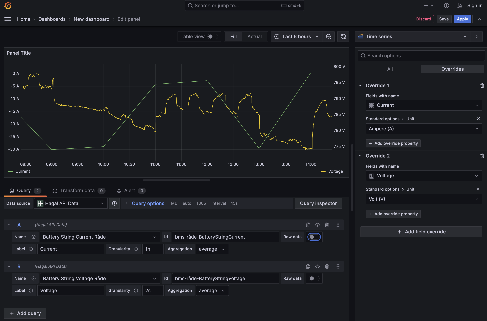

# Hagal API Data Source for Grafana

This plugin serves as a bridge between Grafana and the [Hagal API](https://api.hagal.com/api/v1), allowing users easily visualize and analyze their Hagal battery telemetry data directly within their Grafana dashboards. With this integration, users can leverage Grafana's powerful visualization tools to gain insights from their Hagal data, making the process of monitoring and decision-making smoother and more efficient.

## Features
- **Direct Integration:** Connect directly to  Hagal API for data visualization.
- **Dynamic Dashboards:** Easily create custom dashboards, allowing for flexible layout and detailed time series graph configurations.
- **Timeseries Selection:** Pick your desired timeseries ID from a suggested list.
- **Raw Data Display:** Have the capability to display raw data for a more granular insight.



## Access Hagal Data Platform

**Contact Hagal team**: email you request to info@hagal.com.

## Development
To start development install dependencies

   ```bash
   yarn install
   ```

### Docker
The easiest way to work on this plugin is to run it using Docker.

Spin up a Grafana instance and run the plugin inside it

   ```bash
   yarn run server
   ```
or, for debugging and development, run the plugin in development mode in parallel with a Grafana instance

   ```bash
   yarn run server:watch
   ```

### Local Development Setup
Another way to work on this datasource is to create a symbolic link in data/plugins that points to plugin directory.
```
ln -s /path/to/your/plugin /path/to/grafana/data/plugins/your-plugin
```

Then, for debugging build plugin in development mode run it in watch mode

   ```bash
   yarn run dev
   ```

or build plugin in production mode

   ```bash
   yarn run build
   ```


### Tests
Run the tests (using Jest)

   ```bash
   yarn run test
   ```
